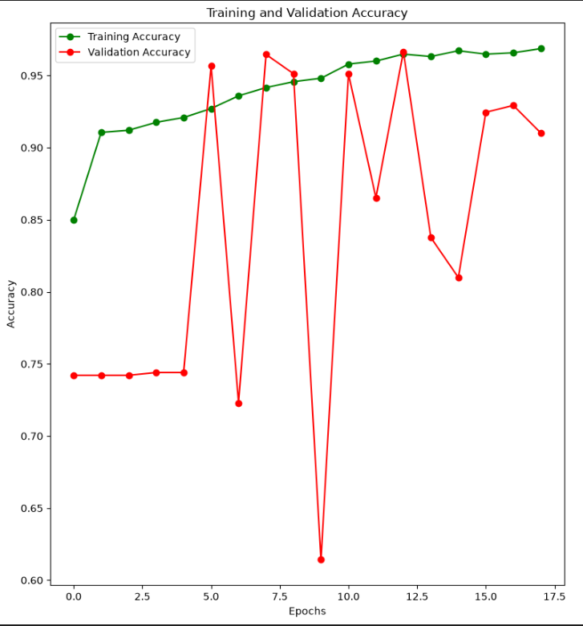
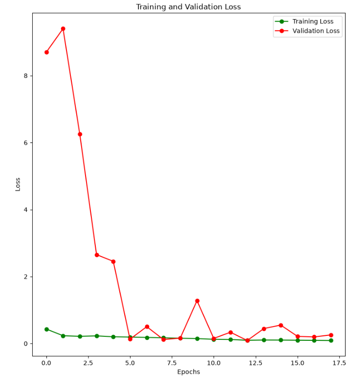
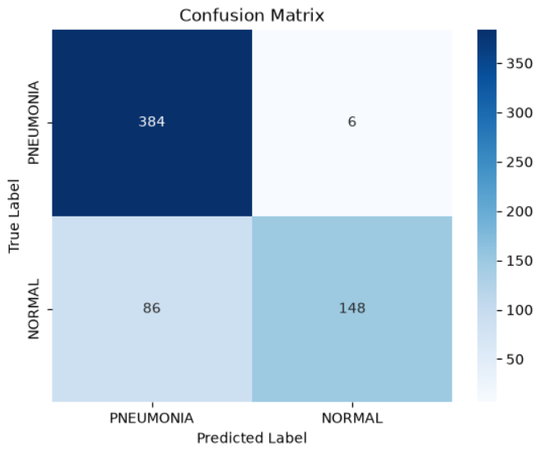
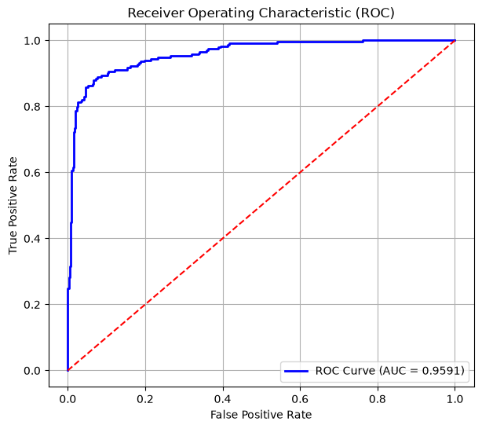
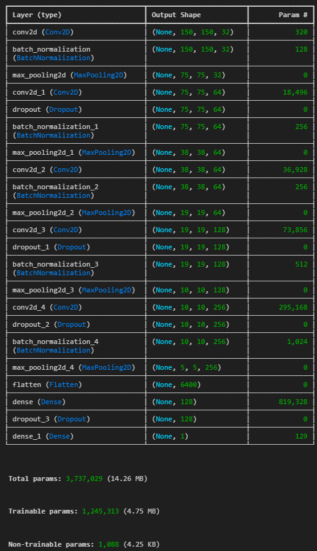
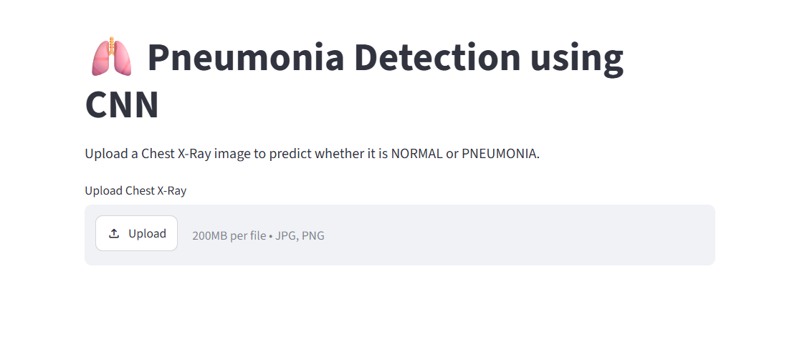

# 🫁 Pneumonia Detection using Convolutional Neural Networks (CNN)

> **Deep Learning | Medical Image Classification | TensorFlow | Keras | Streamlit**


[](https://cnn-based-pneumonia-detection-o7ckr4rxw7noz8bgxbsvaj.streamlit.app/)


---
## 🚀 Live Demo

🌐 **Try the Application:** https://cnn-based-pneumonia-detection-o7ckr4rxw7noz8bgxbsvaj.streamlit.app/

Upload a Chest X-Ray image and receive:

- 🩺 Prediction (NORMAL / PNEUMONIA)
- 📊 Confidence Score
---

# 📌 Project Overview

Pneumonia is one of the leading causes of respiratory illness worldwide. Early and accurate diagnosis using Chest X-Ray images can significantly improve patient outcomes.

This project implements a **Convolutional Neural Network (CNN)** using **TensorFlow and Keras** to automatically classify Chest X-Ray images into **NORMAL** and **PNEUMONIA** categories.

The project demonstrates a complete deep learning workflow—from data preprocessing and augmentation to model training, evaluation, and deployment through a Streamlit web application.

---

# 🎯 Project Objective

Develop an end-to-end Deep Learning pipeline capable of detecting Pneumonia from Chest X-Ray images while following modern deep learning best practices including:

* Image preprocessing
* Data augmentation
* CNN model development
* Model regularization
* Hyperparameter optimization
* Performance evaluation
* Model deployment
* Interactive prediction interface

---

# 📂 Dataset

**Dataset:** Chest X-Ray Images (Pneumonia)

Source: **Mendeley Data**

Dataset Structure:

```text
dataset/

│

├── train/

│     ├── NORMAL/

│     └── PNEUMONIA/

│

└── test/

      ├── NORMAL/

      └── PNEUMONIA/
```

### Classes

* NORMAL
* PNEUMONIA

---

# 🛠️ Technologies Used

* Python
* TensorFlow
* Keras
* NumPy
* Pandas
* Matplotlib
* Scikit-learn
* Streamlit

---

# 🧹 Image Preprocessing

Before training, every image undergoes the following preprocessing steps:

* Convert image to grayscale
* Resize to **150 × 150**
* Normalize pixel values to **0–1**
* Generate batches for efficient training

---

# 🔄 Data Augmentation

To improve model generalization and reduce overfitting, the following augmentation techniques were applied:

* Random Rotation
* Width Shift
* Height Shift
* Zoom
* Horizontal Flip

---

# 🧠 CNN Architecture

The CNN model consists of multiple convolutional blocks followed by fully connected layers.

```text
Input Image (150×150×1)

        │

Conv2D

        │

Batch Normalization

        │

MaxPooling

        │

Dropout

        │

Conv2D

        │

Batch Normalization

        │

MaxPooling

        │

Dropout

        │

Conv2D

        │

Batch Normalization

        │

MaxPooling

        │

Flatten

        │

Dense Layer

        │

Dropout

        │

Dense Layer

        │

Sigmoid Output
```

---

# ⚙️ Training Configuration

| Parameter         | Value                    |
| ----------------- | ------------------------ |
| Framework         | TensorFlow + Keras       |
| Optimizer         | Adam                     |
| Loss Function     | Binary Crossentropy      |
| Output Activation | Sigmoid                  |
| Epochs            | Until Early Stopping     |
| Batch Size        | 32                       |

---

# 🚀 Callbacks Used

### ✅ EarlyStopping

Stops training when validation loss stops improving to prevent overfitting.

---

### ✅ ReduceLROnPlateau

Automatically reduces the learning rate when validation performance plateaus.

---

### ✅ ModelCheckpoint

Saves the best-performing model during training based on validation performance.

---

# 📊 Model Evaluation

The model was evaluated using multiple performance metrics.

### Metrics

* Accuracy
* Precision
* Recall
* ROC-AUC Score
* Confusion Matrix
* Classification Report

---

# 📈 Results

| Metric                | Score          |
| --------------------- | -------------- |
| Validation Accuracy   | **≈ 96%**      |
| ROC-AUC               | **≈ 0.959**    |
| Best Validation Epoch | **≈ Epoch 13** |

The trained CNN achieved strong classification performance while maintaining good generalization through data augmentation and regularization techniques.

---

# 📷 Results Visualization







---

# 🌐 Streamlit Deployment

A user-friendly Streamlit application was developed for real-time inference.

### Features

* Upload Chest X-Ray image
* Predict NORMAL or PNEUMONIA
* Display prediction confidence
* Fast inference using the trained CNN model

---

# 📁 Repository Structure

```text
Pneumonia-Detection-CNN/

│

├── dataset/

├── images/

├── models/

│      best_model.keras

│

├── notebooks/

│      pneumonia_detection.ipynb

│

├── src/

│      train.py

│      predict.py

│      preprocessing.py

│      model.py

│

├── streamlit_app.py

├── requirements.txt

├── README.md

├── LICENSE

└── .gitignore
```

---

# 💻 Installation

### Clone the Repository

```bash
git clone https://github.com/yourusername/Pneumonia-Detection-CNN.git

cd Pneumonia-Detection-CNN
```

### Create Virtual Environment

```bash
python -m venv venv
```

### Activate Environment

**Windows**

```bash
venv\Scripts\activate
```

**Linux / macOS**

```bash
source venv/bin/activate
```

### Install Dependencies

```bash
pip install -r requirements.txt
```

---

# ▶️ Run the Project

### Train the Model

```bash
python src/train.py
```

### Launch Streamlit App

```bash
streamlit run streamlit_app.py
```

---

# 📌 Future Improvements

* Transfer Learning using ResNet50
* EfficientNet Implementation
* MobileNetV2 Comparison
* Grad-CAM Explainability
* Model Quantization
* Docker Deployment
* Cloud Deployment (AWS/GCP/Azure)
* Multi-class Lung Disease Classification

---

# 🎓 Key Learning Outcomes

Through this project, I gained hands-on experience with:

* Deep Learning workflows
* Medical image preprocessing
* CNN architecture design
* Data augmentation techniques
* Callback implementation
* Binary image classification
* Model evaluation using multiple metrics
* Streamlit deployment
* Building an end-to-end Computer Vision application

---

# 📜 License

This project is licensed under the **MIT License**.

---

# 👨‍💻 Author

**Shravan Kundap**

Electronics & Telecommunication Engineering Undergraduate

Aspiring AI/ML Engineer specializing in:

* Machine Learning
* Deep Learning
* Computer Vision
* NLP
* Generative AI
* Agentic AI

⭐ If you found this project interesting, consider giving it a **Star** and sharing your feedback!

